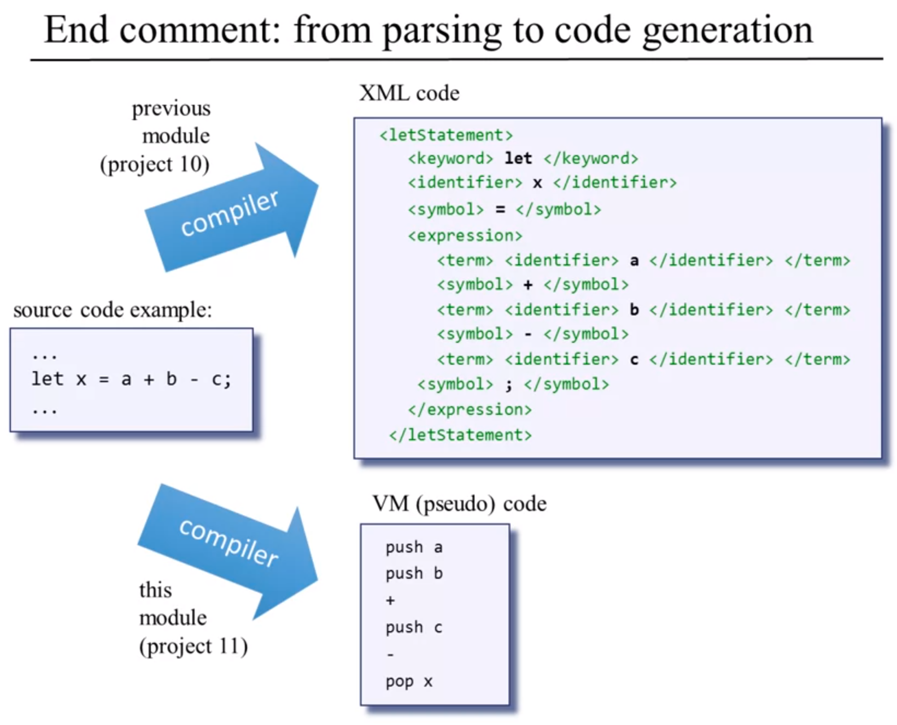
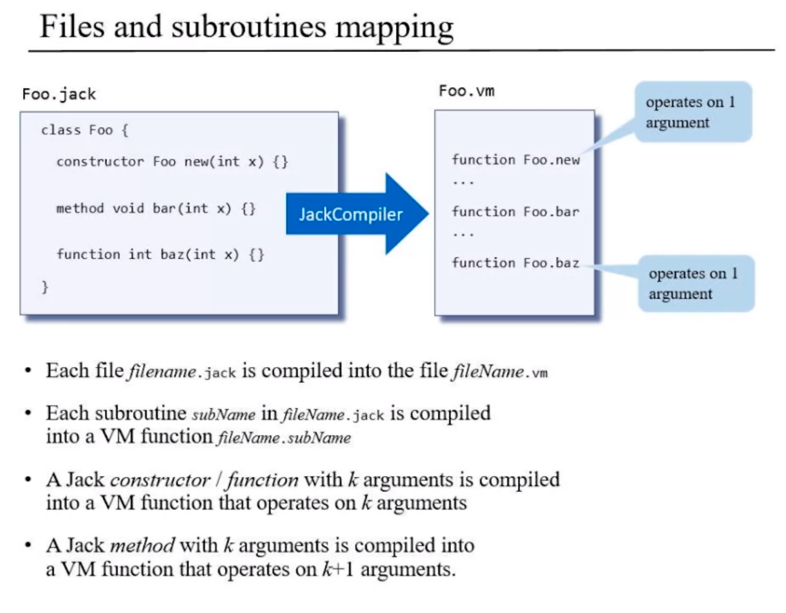

<!-- vim-markdown-toc GFM -->

* [Code Generation](#code-generation)
  * [Usage](#usage)
  * [Implementation](#implementation)
    * [Implement `SymbolTable` Module](#implement-symboltable-module)
    * [Implement `VMWriter` Module](#implement-vmwriter-module)
    * [Implement `CompilationEngine` Module](#implement-compilationengine-module)
  * [Details](#details)
    * [Handling Variables](#handling-variables)
      * [Variable properties(in Jack):](#variable-propertiesin-jack)
      * [Symbol tables](#symbol-tables)
    * [Handling Expressions](#handling-expressions)
    * [Handling Flow of Control](#handling-flow-of-control)
    * [Handling objects:Low-level Aspects](#handling-objectslow-level-aspects)
      * [local,argument](#localargument)
      * [this,that](#thisthat)
    * [Handling objects:Construction](#handling-objectsconstruction)
    * [Handling objects:Manipulation](#handling-objectsmanipulation)
    * [Handling arrays](#handling-arrays)
      * [Array construction](#array-construction)
      * [Array manipulation](#array-manipulation)
    * [Standard Mapping Over the Virtual Machine](#standard-mapping-over-the-virtual-machine)

<!-- vim-markdown-toc -->
## Code Generation


### Usage
``` shell
$ JackCompiler input
```

Input:
* `filename.jack`: name of a single source file, or
* `directoryName`: name of a directory containing one or more .jack source files

Output:
* if the input is a single file: `fileName.vm`
* if the input is a directory: one `.vm` file for every .jack file, stored in
  the same directory.

Implementation notes:
* For each source `.jack` file, the compiler creates `JackTokenizer` and an
output `.vm` file
* Next, the compiler uses the `SymbolTable`, `CompilationEngine`, and
`VMWriter` modules to write the VM code into the output `.vm` file

### Implementation
The overall compiler can thus be constructed using five modules:
* `JackCompiler` :top-level driver that sets up and invokes the other modules;
* `JackTokenizer` :tokenizer;
* `SymbolTable` :symbol table;
* `VMWriter` :output module for generating VM code;
* `CompilationEngine` :recursive top-down compilation engine.

#### Implement `SymbolTable` Module
The following kinds of identifiers may appear in the symbol table:
- `Static`: Scope: class.
- `Field`: Scope: class.
- `Argument`: Scope: subroutine (method/function/constructor).
- `Var`: Scope: subroutine (method/function/constructor).

When compiling error-free Jack code, any identifier not found in the symbol table
may be assumed to be a subroutine name or a class name. Since the Jack language
syntax rules suffice for distinguishing between these two possibilities, and since no
‘‘linking’’ needs to be done by the compiler, there is no need to keep these identifiers
in the symbol table.


#### Implement `VMWriter` Module
`VMWriter`: Emits VM commands into a file, using the VM command syntax.


#### Implement `CompilationEngine` Module
- Gets its input from a `JackTokenizer` and writes its output using the `VMWriter`.
- Organized as a series of `compilexxx` routines, xxx being a syntactic element
in the Jack language.


### Details

#### Handling Variables

* class-level variable
  * field
  * static
* subroutine-level variable
  * argument
  * local


##### Variable properties(in Jack):

* name(identifier)
* type(int, char, boolean, class name)
* kind(field, static, local, argument)
* scope(class level, subroutine level)

Needed for code generation.

Can be managed efficiently using a **symbol table**.

##### Symbol tables


#### Handling Expressions


* [Depth first search](https://en.wikipedia.org/wiki/Depth-first_search)





#### Handling Flow of Control
The challenge
* while
* if

VM code, using:
* goto
* if-goto
* label


#### Handling objects:Low-level Aspects
##### local,argument

##### this,that
* represent *object* and *array* data 
* located on the *heap*
* Object data is accessed via the this segment
* Array data is accessed via that segment
* Before we use these segments, we must first anchor them using pointer

#### Handling objects:Construction
 
#### Handling objects:Manipulation

#### Handling arrays
##### Array construction

##### Array manipulation


#### Standard Mapping Over the Virtual Machine



