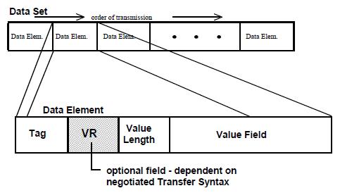

Chapter 3 - DICOM Elements
========================

DICOM element encoding in a DICOM data stream:

Tags
----

  The DICOM tag is comprised of two short numbers called Group and Element.

Value Representation
--------------------

  The VR is represented as two character code. The VR defines the data type of
  the element.

  Because every element has a Tag, the tag implicitly defines the VR, i.e  VR
  is usually redundant and can be omitted.

  However, the common practice and IHE recommendation is to explicitly state
  the VR when serializing DICOM objects into files or into network buffers.
  We’ll talk more about that when we discuss Implicit and Explicit Transfer
  Syntax.

Value Length
------------

  Because DICOM is a binary protocol (in contrast to textual protocols such as
  html and xml) elements have length. DICOM elements length are always even.
  Even if the element’s value is a single character string like Patient Sex
  (0010,0040) that is either ‘M’ for Male or ‘F’ for Female or ‘O’ for Other,
  the element length should be 2 and the value will be padded by a space (ASCII
  0x20). String types (like CS and UI) are padded by space and binary types
  like US are padded by null 0x0.

Summary
-------

* DICOM Elements are the building blocks of the DICOM standards. They are used
  in DICOM files and in network communication.
* Every element has a unique Tag that specifies what’s in the element and its
  data type.
* DICOM Elements are typed. The DICOM data types are called VR.
* Every Element has even length, even if it's value length is odd. Strings are
  padded with a space and binary data with a null.
