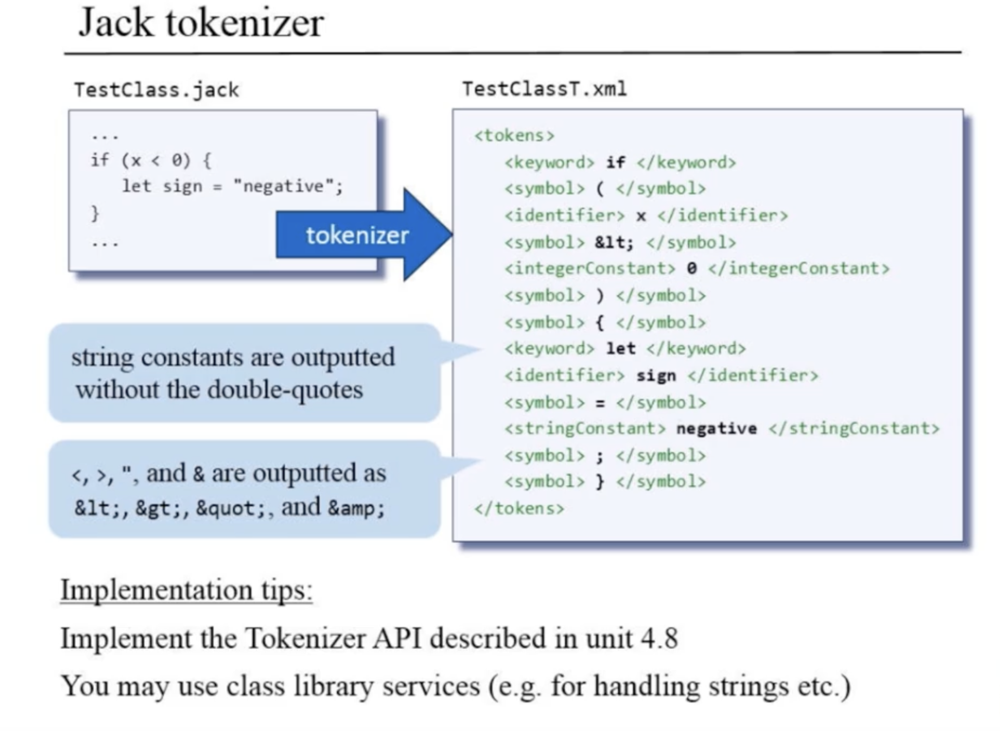

# Jack Compiler


## Jack Analyzer

### Usage
``` shell
$ JackAnalyzer input
```

Input:
* `filename.jack`: name of a single source file, or
* `directoryName`: name of a directory containing one or more .jack source files


Output:
* if the input is a single file: `fileName.xml`
* if the input is a directory: one `.xml` file for every .jack file, stored in
  the same directory.

### Implementation
* Build a Jack Tokenizer
* Build a Jack compilation engine
  * Basic version (handles everything except expressions)
  * complete version (handles everything)

### JackAnalyzer
Top -level driver that sets up and invokes the other modules.

#### JackTokenizer




### CompilationEngine
Recursive top-down parse.
* `save=current`: backtrack input token
* `parent.addChild(NewNode)` only when success: build ast
* [Maximal munch](https://en.wikipedia.org/wiki/Maximal_munch)


