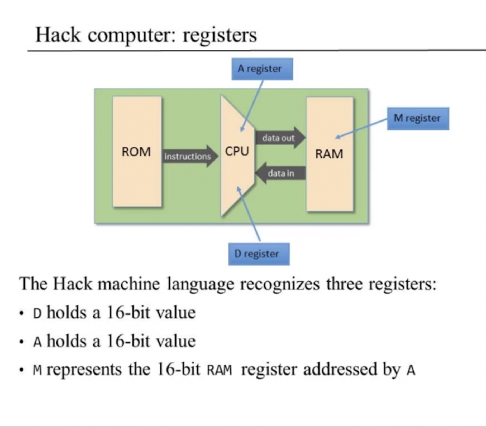
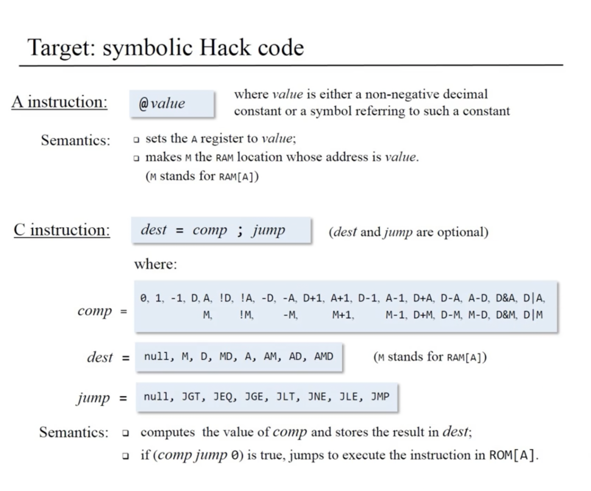
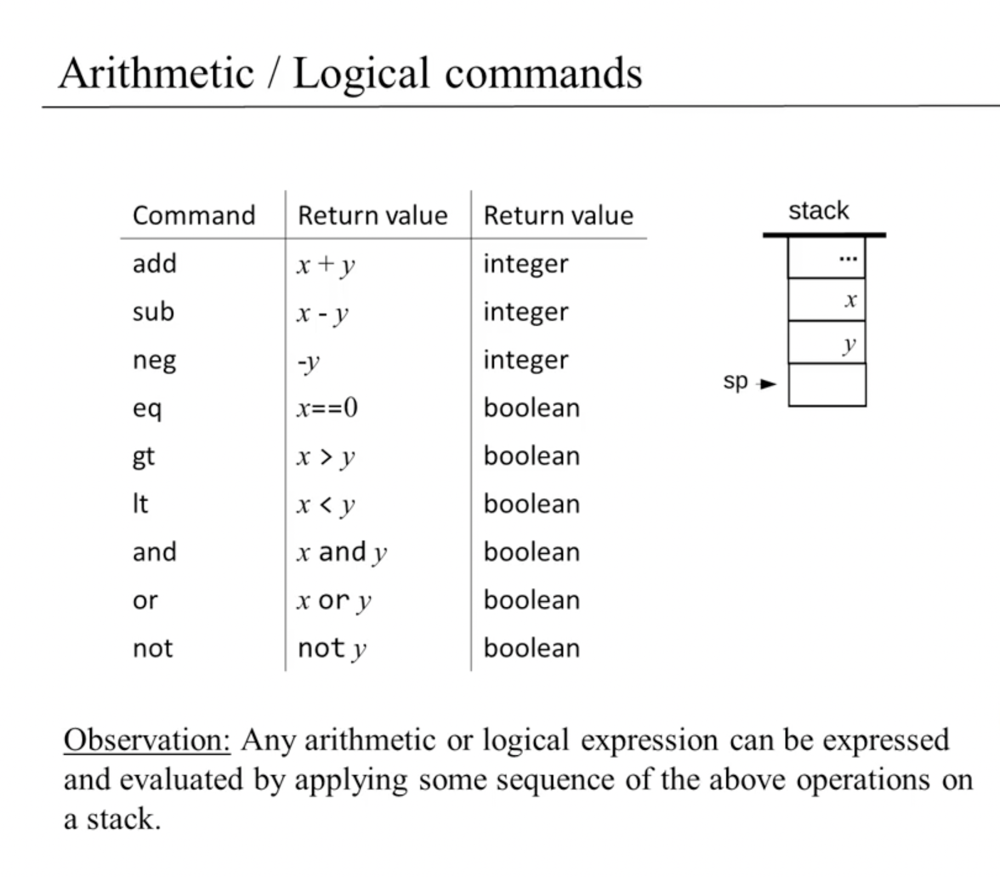
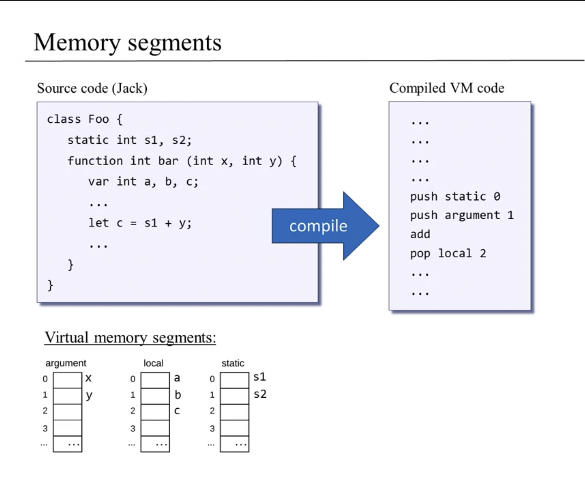
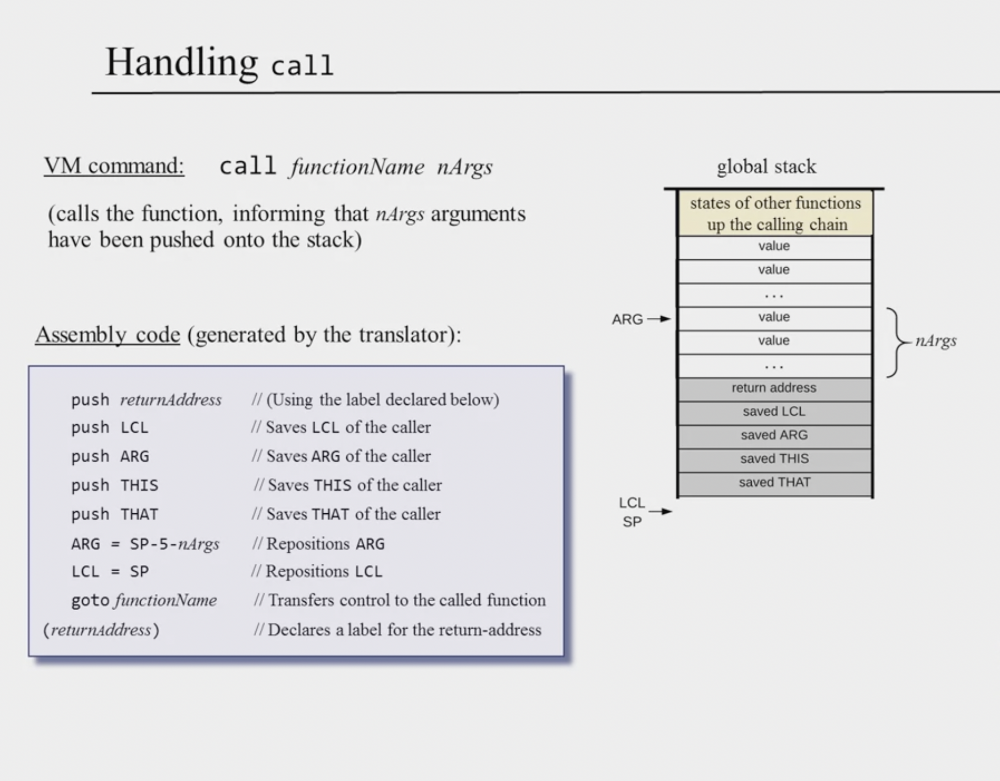
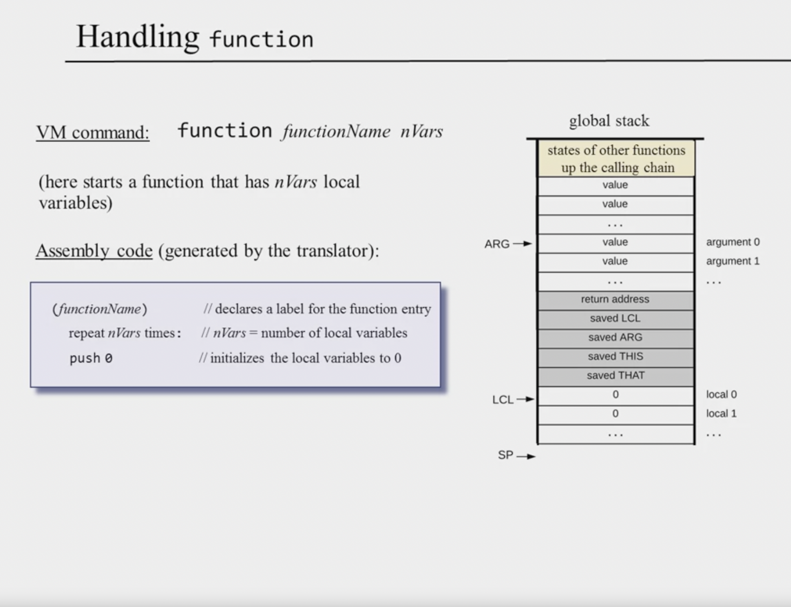
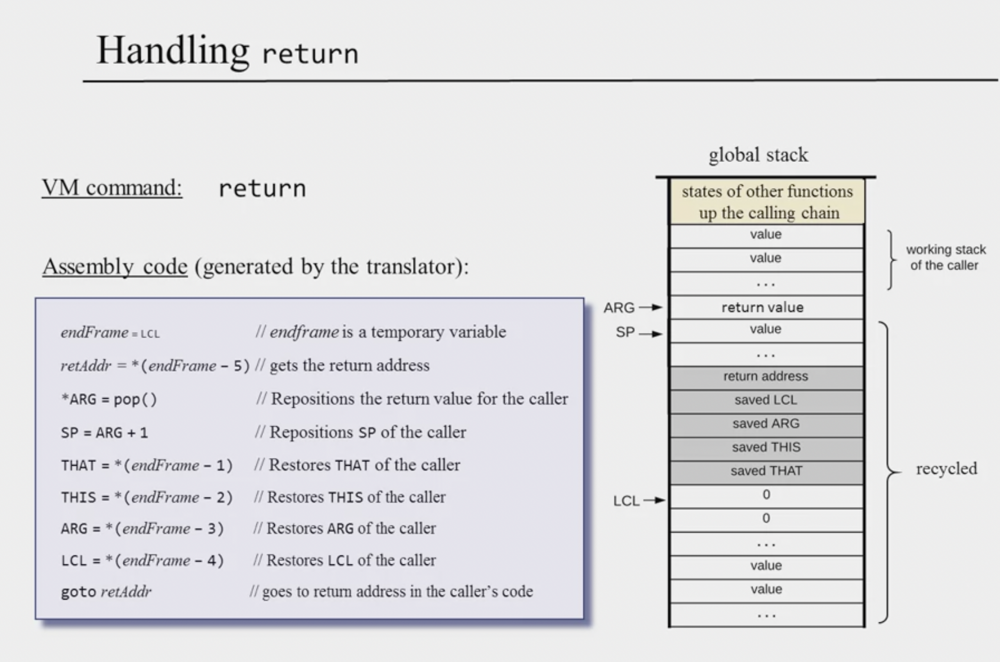
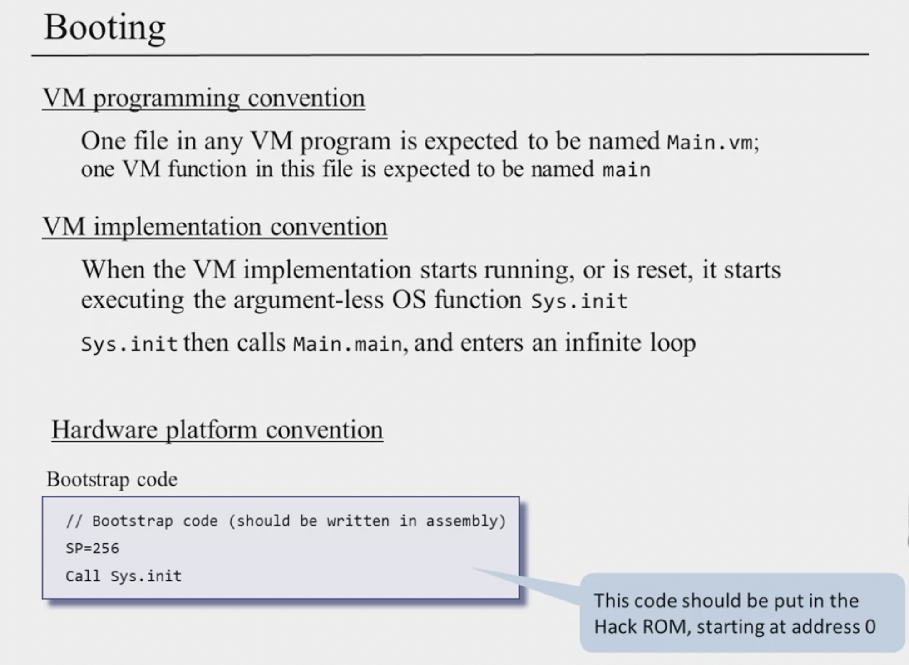
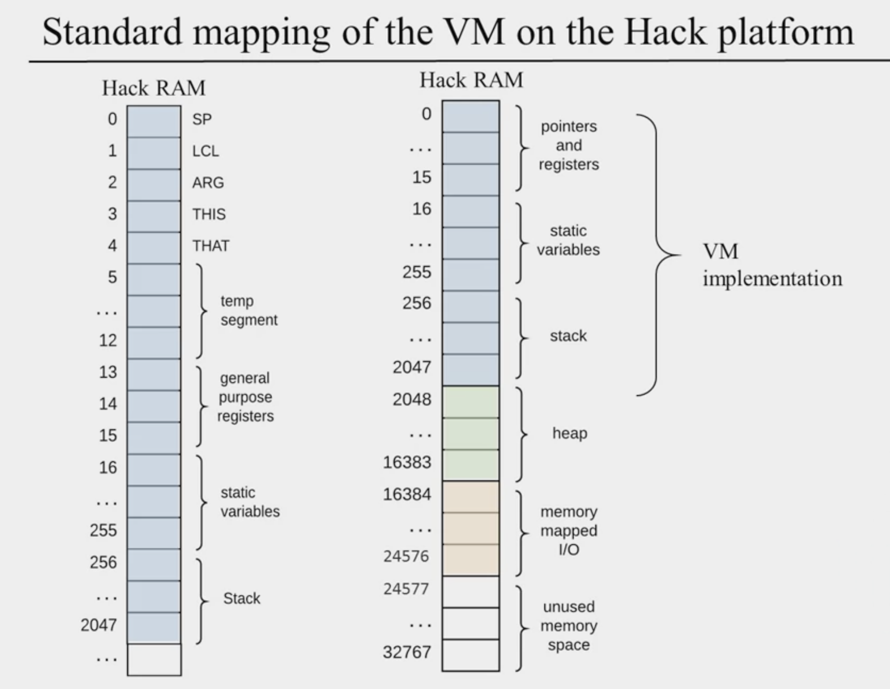
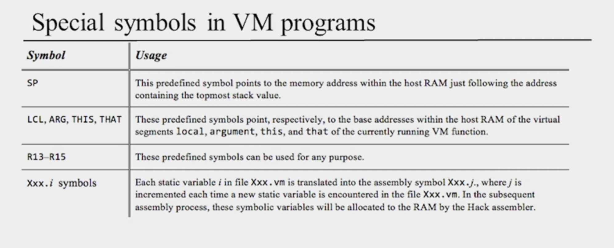

VM Translator
=============

<!-- vim-markdown-toc GFM -->

* [VM Abstraction: the Stack](#vm-abstraction-the-stack)
	* [Arithmetic / Logical Commands](#arithmetic--logical-commands)
* [VM Abstraction: Memory Segments](#vm-abstraction-memory-segments)
* [VM Implementation: the Stack](#vm-implementation-the-stack)
	* [Pointer Manipulation](#pointer-manipulation)
	* [VM Translator Perspective](#vm-translator-perspective)
* [VM Implementation: Memory Segments](#vm-implementation-memory-segments)
	* [**Implementing**  constant](#implementing--constant)
	* [**Implementing**  static](#implementing--static)
	* [**Implementing**  temp](#implementing--temp)
	* [**Implementing**  pointer](#implementing--pointer)
* [VM Implementation: Program Control](#vm-implementation-program-control)
	* [Function Call and Return](#function-call-and-return)
	* [Handling call](#handling-call)
	* [Handling Function](#handling-function)
	* [Handling Return](#handling-return)
	* [Booting](#booting)
	* [mapping](#mapping)
	* [symbols](#symbols)
* [Reference](#reference)

<!-- vim-markdown-toc -->
registers:

hack code:


VM Abstraction: the Stack
-------------------------

high-level:
``` python
x = 17 + 19
```

compile to:

lower-level:
``` VM
push 17
push 19
add
pop x
```

Stack machine, manipulated by:
* Arithmetic / logical commands
* Memory segment commands
* Branching commands
* Function commands


### Arithmetic / Logical Commands



VM Abstraction: Memory Segments
-------------------------------


VM Implementation: the Stack
-----------------------------
### Pointer Manipulation
Logic:
``` c
*sp = 17
sp++
```

Hack assembly:
``` c
@17 // D=17
D=A

@sp // *sp=D
A=M
M=D

@sp //sp++
M=M+1
```
### VM Translator Perspective
VM code:
``` c
push constant i
```

**VM Translator**

Assembly code:
```
*sp = i, sp++
```

VM Implementation: Memory Segments
----------------------------------


VM code:
``` c
push segment i
pop segment i
```

**VM Translator**

Assembly code:
``` c
addr = segmentPointer + i, *SP=*addr, SP++
addr = segmentPointer + i, SP--, *addr=*SP
```

### **Implementing**  constant
`push constant i` --> `*SP=i, SP++`

### **Implementing**  static
``` c
...
pop static 5
...
pop static 2
...
```

--> 

``` c
...
@Foo.5
M=D

...
@Foo.2
M=D
...
```

* Have the VM translator translate each VM reference static i(in file Foo.vm)
  into an assembly reference Foo.i
 
### **Implementing**  temp
``` c
push temp i
pop temp i
```
-->

``` c
addr = 5 + i, *SP=*addr, SP++
addr = 5 + i, *SP--, *addr=*SP
```

* Mapped on RAM locations 5 to 12
* [SP, LCL, ARG, THIS, THAT] [temp segment(5:12)] [pointer]
 
### **Implementing**  pointer
``` c
push pointer 0/1 // 0:THIS, 1:THAT
pop pointer 0/1
```

-->

``` c
*SP=THIS/THAT, SP++
SP--, THIS/THAT=*SP
```

VM Implementation: Program Control
----------------------------------
### Function Call and Return
VM code(arbitrary example):
``` c
function Foo.main 4
   ...
   // computes -(19 * (local 3))
   push constant 19
   push local 3
   call Bar.mult 2
   neg
   ...
function Bar.mult 2
    // Returns the product of two
    // arguments(result in local 1)
    ...
    push local 1
    return
```
-->
``` c
(Foo.main)
    ...
    // sets up for the function call, and the:
    goto Bar.mult // (in assembly)
(Foo$ret.1)
    // assembly code that handles neg
    ...
(Bar.mult)
    ...
    // assembly code that handles push local 1
    // Assembly code that moves the return value to the caller, reinstates the
    // caller's state, and the:
    goto Foo$ret.1 // (in assembly) 
```


VM function commands:

* call `functionName nArgs`
* function `functionName nVars`
* return

Contract: the calling function's view
* Before calling another function, I must push as many arguments as the
  function expects to get
* Next, I invoke the function using call `functionName nArgs`
* After the called function returns, the arguments values that I pushed before
  the call have disappeared from the stack, and a `return value`(that always
  exists) appears at the top of the stack;
* After the called function returns, all my memory segments are exactly the
  same as they were before the call

(except that `temp` is undefined and some values of my `static` segments may
have changed).

Contract: the called function's view
* Before I start executing, my argument segment has been initialized the
  argument values passed by the caller
* My `local` variables segment has been allocated and initialized to zeros
* My `static` segment has been set to the static segment of the VM to which I
  belong

(memory segments `this`, `that`, `pointer`, and `temp` are undefined upon entry)

* My working stack is empty
* Before returning, I must push a value onto the stack.

### Handling call


### Handling Function


### Handling Return


### Booting


### mapping


### symbols



Reference
---------

- https://www.coursera.org/lecture/nand2tetris2/unit-1-8-vm-translator-proposed-implementation-qmJl3
- https://github.com/rose/nand2tetris
- https://github.com/xctom/Nand2Tetris/blob/master/projects/07/MemoryAccess/BasicTest/BasicTest.asm
