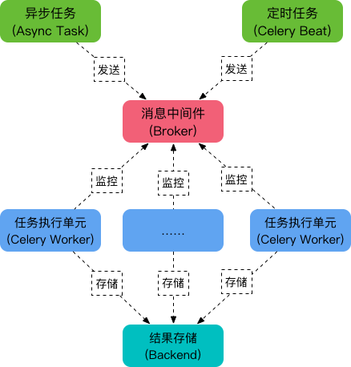

Celery
======

Celery has 5 main roles:
* Task
* Broker
* Worker
* Beat
* Backend



Simple Usage
------------

Working directory:
``` python
Celery
├── task.py
└── user.py
```

``` python
# tasks.py
import time
from celery import Celery

app = Celery('tasks', broker='redis://localhost:6379/0')

@app.task
def sendmail(mail):
    print('sending mail to %s...' % mail['to'])
    time.sleep(2.0)
    print('mail sent.')
```
``` python
# user.py
from task import sendmail
import time


def register():
    start = time.time()
    print("1. Insert record to database")
    print('2. Celery send mail')
    sendmail.delay({"to": 'somebody'})
    print("3. Inform user register successful")
    print(f"durations: {time.time() - start} seconds")


if __name__ == '__main__':
    register()
```

